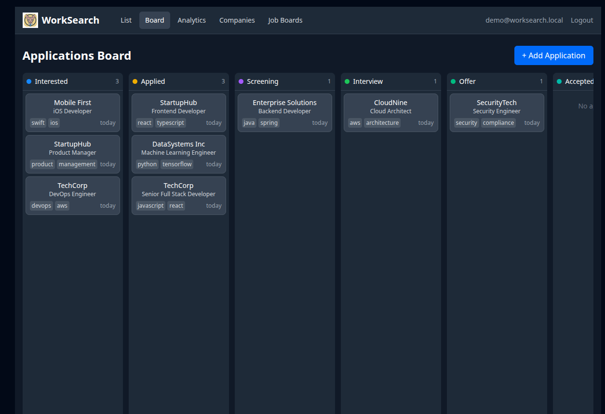
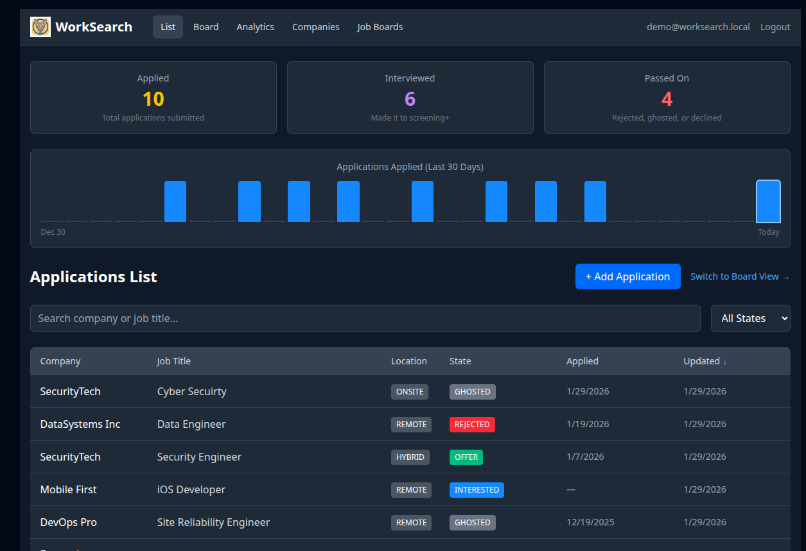
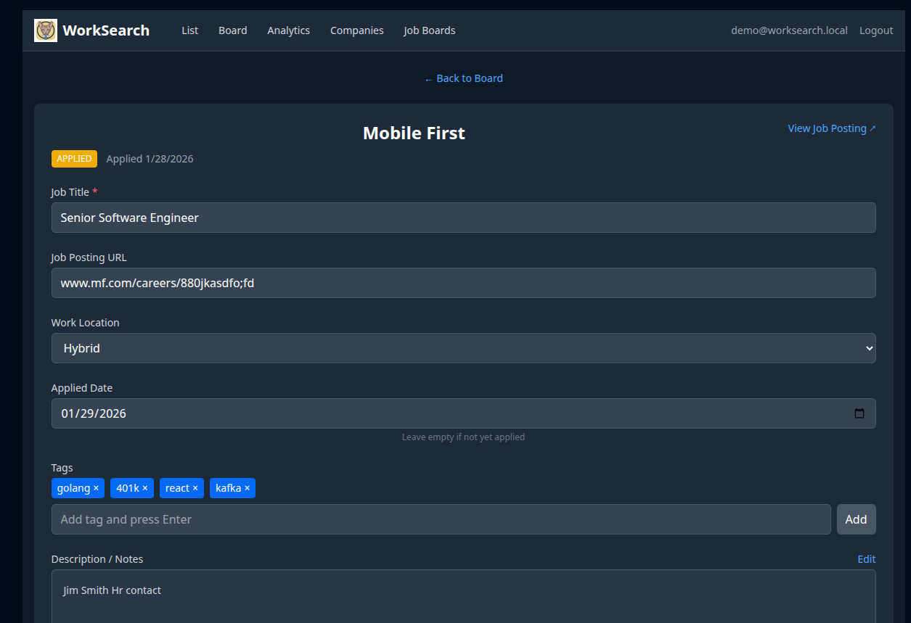
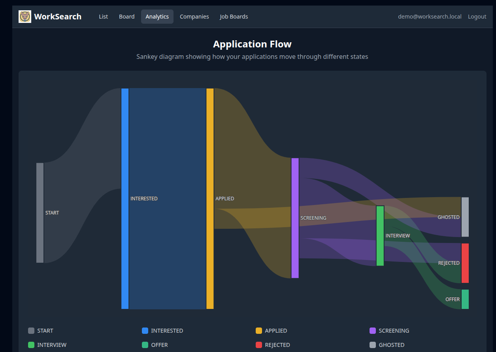
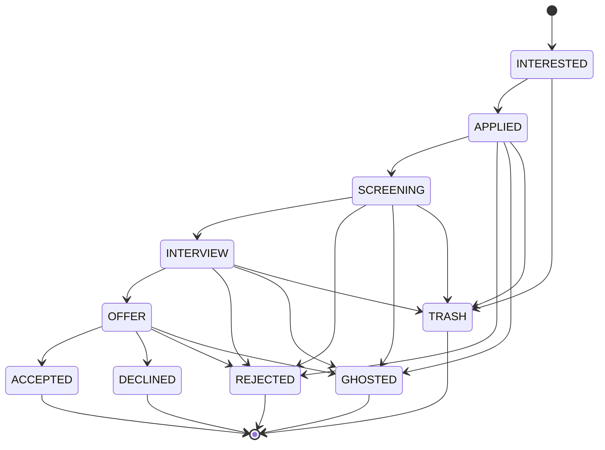

<div align="center">

# 🐱 WorkSearch

**Your job hunt, organized.**

A modern, self-hosted job application tracker with a Kanban board, powerful filtering, and full control over your data.

[](https://nestjs.com/)
[](https://react.dev/)
[](https://postgresql.org/)
[](https://docker.com/)
[](https://typescriptlang.org/)

</div>

---

## ✨ Features

🎯 **Track Every Application**  
Never lose track of where you applied. Log jobs as "Interested" and move them through your pipeline.

📋 **Kanban Board & List Views**  
Drag-and-drop applications between states, or use the powerful list view with search and filters.

🏢 **Company Management**  
Keep notes on companies, track how many roles you've applied to at each one.

📌 **Job Boards**  
Bookmark your favorite job boards with notes—no more forgetting that niche site.

🏷️ **Tags & Work Location**  
Organize with custom tags. Filter by Remote, Hybrid, Onsite, or Contract.

📊 **Analytics Dashboard**  
Visualize your job search with a Sankey diagram showing flow from applications to outcomes.

👥 **Multi-User Ready**  
Each user has isolated data. Admin panel for user management.

🔒 **Self-Hosted & Private**  
Your job search data stays on your server. No third-party tracking.

---

## 🚀 Quick Start

### Prerequisites

- [Docker](https://docs.docker.com/get-docker/) & Docker Compose
- That's it! Everything runs in containers.

### 1. Clone & Configure

```bash
git clone https://github.com/robstave/worksearch.git
cd worksearch

# Create your environment file
cp .env.example .env

# Edit .env and set a secure APP_SECRET (any long random string)
```

### 2. Start the Stack

```bash
docker compose up -d
```

### 3. Open & Login

| Service | URL |
|---------|-----|
| **Web App** | [http://localhost:5173](http://localhost:5173) |
| **API** | [http://localhost:3000/api](http://localhost:3000/api) |

**Default Credentials:**

| User | Email | Password | Role |
|------|-------|----------|------|
| Admin | `admin@worksearch.local` | `admin123` | Full access + user management |
| Demo | `demo@worksearch.local` | `demo123` | Standard user |

> ⚠️ **Change these passwords** after first login!

---

## 📸 Screenshots

<details>
<summary>Click to expand</summary>

### Kanban Board
*Drag applications between columns as they progress*



### List View
*Search, filter, and sort all your applications*



### Application Detail
*Full job description with markdown support*



### Analytics
*Sankey diagram showing your application flow*



</details>

---

## 🔄 Application States

Applications flow through a state machine:



---

## 🛠️ Tech Stack

| Layer | Technology |
|-------|------------|
| **Frontend** | React 18, Vite, Tailwind CSS, TypeScript |
| **Backend** | NestJS, Prisma ORM, Express Session |
| **Database** | PostgreSQL |
| **Deployment** | Docker Compose |

---

## 📁 Project Structure

```
worksearch/
├── apps/
│   ├── api/                 # NestJS backend
│   │   ├── src/
│   │   │   ├── auth/        # Session authentication
│   │   │   ├── companies/   # Company CRUD
│   │   │   ├── applications/# Applications + state machine
│   │   │   ├── job-boards/  # Job board bookmarks
│   │   │   └── admin/       # User administration
│   │   └── prisma/          # Database schema & migrations
│   │
│   └── web/                 # React frontend
│       └── src/
│           ├── pages/       # Route components
│           ├── components/  # Shared UI components
│           └── api.ts       # Typed API client
│
├── docs/
│   └── specs/               # Feature specifications
│
└── docker-compose.yml       # One-command deployment
```

---

## 🔧 Development

### Running Locally (without Docker)

```bash
# API
cd apps/api
npm install
npm run start:dev

# Web (in another terminal)
cd apps/web
npm install
npm run dev
```

### Database Commands

```bash
# Run migrations
docker compose exec api npx prisma migrate dev

# Reset database (⚠️ destroys data)
docker compose exec api npx prisma migrate reset --force

# Seed default users
docker compose exec api npm run db:seed

# Open Prisma Studio (database GUI)
docker compose exec api npx prisma studio
```

### Logs

```bash
docker compose logs -f api   # Backend logs
docker compose logs -f web   # Frontend logs
docker compose logs -f db    # Database logs
```

---

## 🔐 User Roles

| Role | Capabilities |
|------|-------------|
| `admin` | Everything + User management panel |
| `aiuser` | Everything + AI features (coming soon) |
| `user` | Companies, Applications, Job Boards |

---

## 🗺️ Roadmap

- [x] Core application tracking
- [x] Kanban board with drag-drop
- [x] Multi-user with admin panel
- [x] Analytics dashboard
- [ ] Application notes/events timeline
- [ ] AI-powered company autofill
- [ ] CSV import/export
- [ ] Mobile-optimized views
- [ ] Browser extension for quick capture

---

## 🤝 Contributing

Contributions welcome! Please read the specs in `/docs/specs/` to understand the project architecture.

1. Fork the repository
2. Create a feature branch (`git checkout -b feature/amazing-feature`)
3. Commit your changes (`git commit -m 'Add amazing feature'`)
4. Push to the branch (`git push origin feature/amazing-feature`)
5. Open a Pull Request

---

## 📄 License

This project is for personal use. See LICENSE file for details.

---

<div align="center">

**Built with ☕ and determination during the job search grind.**

*Because spreadsheets are chaos and you deserve better.*

</div>
